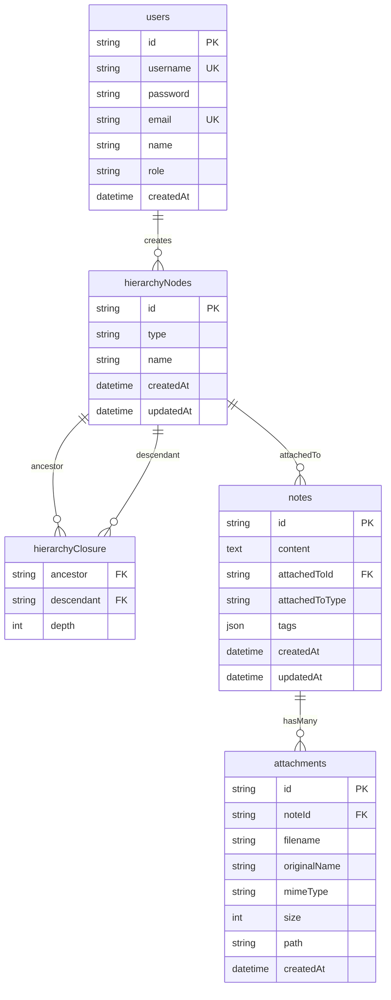
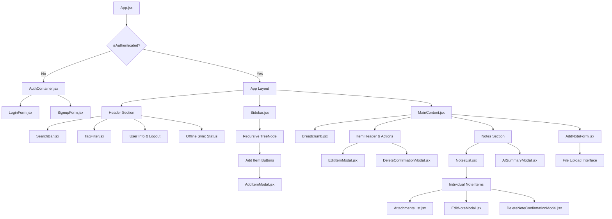

# Healthcare Note-Taker App - Detailed Flow Chart

## Complete Application Architecture & Flow

```mermaid
graph TB
    %% Entry Point
    Start([App Start]) --> InitAuth{Check Authentication}
    
    %% Authentication Flow
    InitAuth -->|Not Authenticated| AuthContainer[AuthContainer Component]
    InitAuth -->|Authenticated| MainApp[Main App Layout]
    
    %% Auth Container Flow
    AuthContainer --> AuthChoice{Login or Signup?}
    AuthChoice -->|Login| LoginForm[LoginForm Component]
    AuthChoice -->|Signup| SignupForm[SignupForm Component]
    
    %% Login Flow
    LoginForm --> LoginAPI[POST /api/auth/login]
    LoginAPI -->|Success| StoreToken[Store JWT Token & User Data]
    LoginAPI -->|Failure| LoginError[Show Login Error]
    StoreToken --> MainApp
    LoginError --> LoginForm
    
    %% Signup Flow
    SignupForm --> SignupAPI[POST /api/auth/signup]
    SignupAPI -->|Success| StoreToken
    SignupAPI -->|Failure| SignupError[Show Signup Error]
    SignupError --> SignupForm
    
    %% Main App Layout
    MainApp --> LoadData[Load Initial Data]
    LoadData --> DataAPI[GET /api/data]
    DataAPI --> BuildLayout[Build App Layout]
    
    %% App Layout Components
    BuildLayout --> Header[Header with User Info & Search]
    BuildLayout --> Sidebar[Sidebar Component]
    BuildLayout --> MainContent[MainContent Component]
    
    %% Sidebar Flow
    Sidebar --> HierarchyTree[Display Hierarchy Tree]
    HierarchyTree --> OrgNodes[Organization Nodes]
    OrgNodes --> TeamNodes[Team Nodes]
    TeamNodes --> ClientNodes[Client Nodes]
    ClientNodes --> EpisodeNodes[Episode Nodes]
    
    %% Node Selection Flow
    OrgNodes -->|Click| SelectItem[Set Selected Item & Type]
    TeamNodes -->|Click| SelectItem
    ClientNodes -->|Click| SelectItem
    EpisodeNodes -->|Click| SelectItem
    
    %% Add Item Flow
    OrgNodes -->|Add Button| AddModal[AddItemModal]
    TeamNodes -->|Add Button| AddModal
    ClientNodes -->|Add Button| AddModal
    
    AddModal --> AddItemAPI[POST /api/{type}s]
    AddItemAPI -->|Success| RefreshData[Reload Data & Update UI]
    AddItemAPI -->|Failure| AddError[Show Add Error]
    RefreshData --> HierarchyTree
    
    %% Main Content Flow
    SelectItem --> MainContent
    MainContent --> Breadcrumb[Breadcrumb Navigation]
    MainContent --> ItemHeader[Item Header with Edit/Delete]
    MainContent --> NotesSection[Notes Section]
    MainContent --> AddNoteForm[Add Note Form]
    
    %% Notes Display Flow
    NotesSection --> LoadNotes[Load Notes for Selected Item]
    LoadNotes --> OnlineNotes[Online Notes from Database]
    LoadNotes --> OfflineNotes[Offline Notes from localStorage]
    OnlineNotes --> NotesList[NotesList Component]
    OfflineNotes --> NotesList
    
    %% Add Note Flow
    AddNoteForm --> ValidateNote{Validate Note Content}
    ValidateNote -->|Valid| CheckOnline{Is Online?}
    ValidateNote -->|Invalid| NoteError[Show Validation Error]
    
    CheckOnline -->|Online| AddNoteAPI[POST /api/notes]
    CheckOnline -->|Offline| SaveOffline[Save to localStorage]
    
    AddNoteAPI -->|Success| UpdateNotesList[Update Notes List]
    AddNoteAPI -->|Failure| SaveOffline
    SaveOffline --> UpdateNotesList
    
    %% File Attachment Flow
    AddNoteForm --> FileUpload{Files Selected?}
    FileUpload -->|Yes| UploadFiles[Upload Files via FormData]
    FileUpload -->|No| AddNoteAPI
    UploadFiles --> AttachmentAPI[POST /api/notes/{id}/attachments]
    AttachmentAPI --> AddNoteAPI
    
    %% Edit/Delete Item Flow
    ItemHeader -->|Edit| EditModal[EditItemModal]
    ItemHeader -->|Delete| DeleteModal[DeleteConfirmationModal]
    
    EditModal --> UpdateAPI[PUT /api/{type}s/{id}]
    DeleteModal --> DeleteAPI[DELETE /api/{type}s/{id}]
    
    UpdateAPI --> RefreshData
    DeleteAPI --> RefreshData
    
    %% Search Flow
    Header --> SearchBar[SearchBar Component]
    SearchBar --> SearchInput[Search Input Field]
    SearchInput -->|Type| SearchNotes[Search All Notes]
    SearchNotes --> SearchResults[Display Search Results]
    SearchResults -->|Select Result| SelectSearchItem[Navigate to Item]
    SelectSearchItem --> SelectItem
    
    %% Tag Filter Flow
    Header --> TagFilter[TagFilter Component]
    TagFilter --> AvailableTags[Show Available Tags]
    AvailableTags -->|Select Tag| FilterNotes[Filter Notes by Tag]
    FilterNotes --> NotesList
    
    %% AI Summary Flow
    NotesSection -->|AI Summary Button| AISummaryModal[AISummaryModal]
    AISummaryModal --> AIRequest[POST /api/ai/summarize]
    AIRequest --> GeminiAPI[Google Gemini API Call]
    GeminiAPI --> AISummary[Display AI Summary]
    
    %% Offline Sync Flow
    Header --> OfflineStatus[Show Offline Status]
    OfflineStatus -->|Back Online| SyncButton[Sync Button]
    SyncButton --> SyncOfflineNotes[Sync Offline Notes]
    SyncOfflineNotes --> SyncAPI[POST /api/notes for each offline note]
    SyncAPI --> ClearOffline[Clear Offline Storage]
    ClearOffline --> UpdateNotesList
    
    %% Logout Flow
    Header -->|Logout| LogoutAPI[POST /api/auth/logout]
    LogoutAPI --> ClearAuth[Clear Authentication Data]
    ClearAuth --> AuthContainer
```

## Database Schema & Relationships



## Component Hierarchy & Data Flow



## API Endpoints & Backend Flow

```mermaid
graph LR
    subgraph "Authentication APIs"
        A1[POST /api/auth/login] --> JWT[Generate JWT Token]
        A2[POST /api/auth/signup] --> JWT
        A3[POST /api/auth/logout] --> ClearSession[Clear Session]
        A4[GET /api/auth/me] --> UserData[Return User Data]
    end
    
    subgraph "Data APIs"
        D1[GET /api/data] --> BuildHierarchy[Build Hierarchical Data]
        D2[GET /api/{type}s] --> GetByType[Get Items by Type]
        D3[GET /api/{type}s/{id}] --> GetById[Get Item by ID]
    end
    
    subgraph "CRUD APIs"
        C1[POST /api/{type}s] --> CreateItem[Create Hierarchy Item]
        C2[PUT /api/{type}s/{id}] --> UpdateItem[Update Item]
        C3[DELETE /api/{type}s/{id}] --> DeleteCascade[Delete with Cascade]
        
        N1[POST /api/notes] --> CreateNote[Create Note]
        N2[PUT /api/notes/{id}] --> UpdateNote[Update Note]
        N3[DELETE /api/notes/{id}] --> DeleteNote[Delete Note]
        N4[GET /api/notes/{type}/{id}] --> GetNotes[Get Notes for Item]
    end
    
    subgraph "File APIs"
        F1[POST /api/notes/{id}/attachments] --> UploadFile[Upload File with Multer]
        F2[GET /api/notes/{id}/attachments] --> ListFiles[List Attachments]
        F3[GET /api/attachments/{id}/download] --> DownloadFile[Download File]
        F4[DELETE /api/attachments/{id}] --> DeleteFile[Delete File]
    end
    
    subgraph "AI APIs"
        AI1[POST /api/ai/summarize] --> GeminiCall[Call Google Gemini API]
        GeminiCall --> AISummary[Return AI Summary]
    end
```

## State Management Flow (SolidJS Signals)

```mermaid
graph TB
    subgraph "Global State (store.js)"
        S1[data - Hierarchy & Notes Data]
        S2[selectedItem - Currently Selected Item]
        S3[selectedType - Type of Selected Item]
        S4[loading - Loading State]
        S5[error - Error State]
        S6[searchQuery - Search Input]
        S7[searchResults - Search Results]
        S8[selectedTags - Active Tag Filters]
        S9[availableTags - All Available Tags]
        S10[offlineNotes - Offline Stored Notes]
        S11[isOnline - Network Status]
    end
    
    subgraph "Auth State (auth.js)"
        A1[isAuthenticated - Auth Status]
        A2[user - Current User Data]
        A3[token - JWT Token]
        A4[authLoading - Auth Loading State]
        A5[authError - Auth Error State]
    end
    
    subgraph "Component State"
        C1[Local Modal States]
        C2[Form Input States]
        C3[UI Toggle States]
    end
    
    S1 --> Components[All Components]
    S2 --> MainContent
    S3 --> MainContent
    S6 --> SearchBar
    S7 --> SearchResults
    S10 --> NotesList
    
    A1 --> App
    A2 --> Header
    A3 --> APIRequests[All API Requests]
```



## Feature Implementation Details

### 1. Authentication System
- **JWT-based authentication** with bcrypt password hashing
- **Role-based access control** (admin vs clinician)
- **Persistent login** using localStorage
- **Auto-logout** on token expiration
- **Admin passcode** required for admin signup

### 2. Hierarchical Data Management
- **4-level hierarchy**: Organization → Team → Client → Episode
- **Closure table pattern** for efficient tree operations
- **Cascading deletes** when parent items are removed
- **Parent-child relationships** maintained in database
- **Admin-only** organization creation/deletion

### 3. Notes System
- **Attached to any hierarchy level** for flexible organization
- **Rich text content** with tag support
- **File attachments** (PDF, images, documents) up to 25MB
- **Search functionality** across all note content
- **Tag-based filtering** for easy categorization

### 4. Offline Functionality
- **localStorage-based** offline note storage
- **Network status detection** with visual indicators
- **Automatic sync** when connection restored
- **Offline note badges** to distinguish from online notes
- **Graceful degradation** when API unavailable

### 5. AI Integration
- **Google Gemini API** for note summarization
- **Healthcare-focused prompts** for clinical context
- **Batch processing** of multiple notes
- **Error handling** for API failures
- **Rate limiting** awareness

### 6. File Management
- **Multer middleware** for file uploads
- **File type validation** and size limits
- **Secure file storage** with unique filenames
- **Download functionality** with proper headers
- **Cleanup on deletion** to prevent orphaned files

### 7. Search & Filtering
- **Real-time search** across all note content
- **Hierarchy context** in search results
- **Tag-based filtering** with multiple tag support
- **Search result navigation** to source items
- **Clear search/filter** functionality

### 8. Responsive Design
- **Mobile-first approach** with Bootstrap
- **Collapsible sidebar** for mobile devices
- **Touch-friendly interfaces** on mobile
- **Adaptive layouts** for different screen sizes
- **FontAwesome icons** for consistent UI

This comprehensive flow chart shows how the healthcare note-taker app handles user authentication, hierarchical data management, note creation with file attachments, offline functionality, AI-powered summarization, and responsive design across all features.
